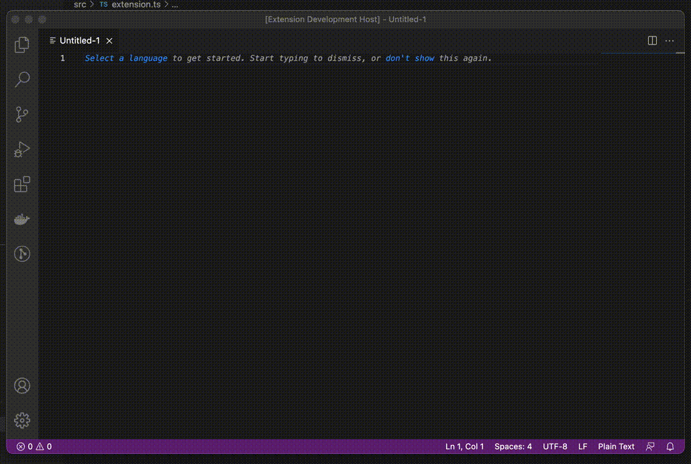
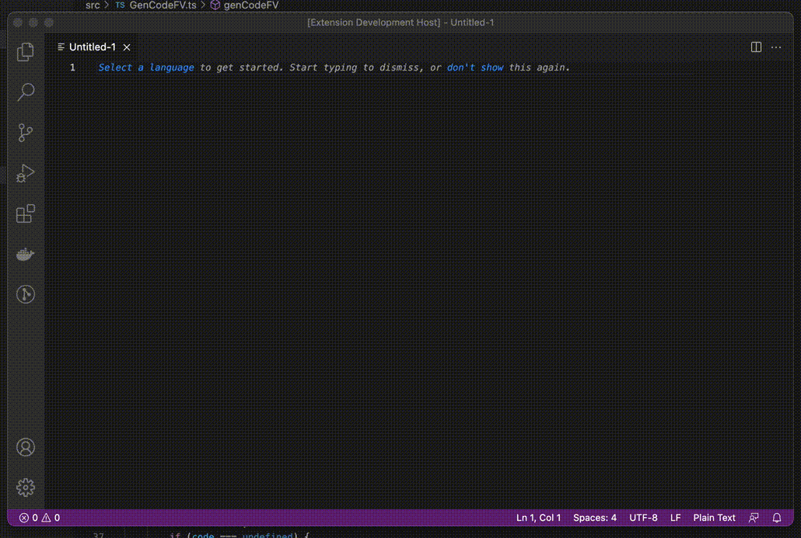

# text-generator README

A vscode extension to generate text using Template String and JavaScript Expression.

## Features

Generate text using template string and JavaScript expression in batches:  `${idx*1} + ${idx*2} = ${idx*3}`

Generate text using JavaScript expression: `${[1, 2, 3].join('-')}`

## Usage

* Command: Generate Text with Template
* Keybindings: CTRL+ALT+G on Windows and Linux or CMD+OPTION+G on OSX

You can input template string in the first Inputbox and use any JavaScript expression in `${}`. 

There are some builtin variables.

| Name | Description                                                  |
| ---- | ------------------------------------------------------------ |
| idx  | Represents the 0-based index. Then enter the amount of text you want to generate in the second input box, which defaults to 1. |
| sel  | Represents current selected string.                          |
